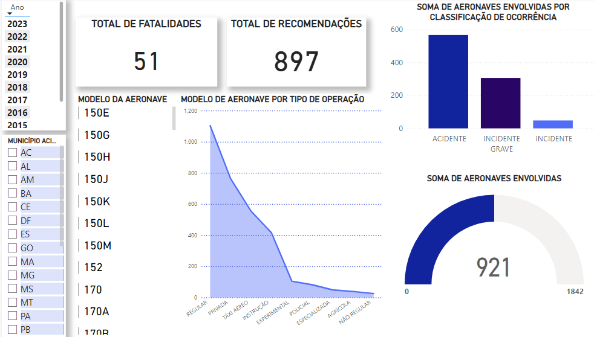

# Trajectory
Aqui irei representar todos os trabalhos realizados e conhecimentos obtidos atravéz das aulas neste primeiro semestre.

# Índice 
- PowerPoint
- Excel
- PowerBI
- PowerApp
- Power Automate

# PowerPoint
Essa foi a primeira tarefa atribuída do semestre. O objetivo dela era integrar os alunos, para que todos se conhecessem melhor. Foi um trabalho em grupo, e eu o fiz com os alunos: Gabriel Barradas, Ana Clara e Mariana.

- [Visualizar Apresentação](Apresentação.powerpoint.pdf)

# Excel
No excel nós aprendemos a usar fórmulas para calculas soma, lucro, receita, gasto, etc. Nessa atividade específica nós colocamos nossos gastos mensais e com as fórmulas foi possível saber a situação financeira mensal.

# Power BI
Nós desenvolvemos uma vizualização interayiva com dados abertos. No meu dashboard eu utilizei dados do CENIPA, e deselvolvi uma vizualização com o objetivo de demonstrar acidentes na aviação cívil brasileira.

- [Visualizar Apresentação](acidentes.pbix)

